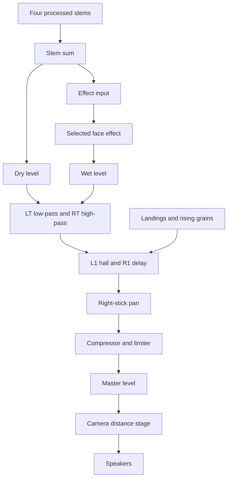

# The audio graph

Audible Field uses one Web Audio graph for every view. The graph is built by `audio-engine.js` and normally stays in place until the page closes. Tabs change its controls instead of creating separate mixers.

Two terms are important in this guide:

- A **bed** is the looping sample played for one quadrant.
- A **stem** is that bed plus its gain, pan, filters, and effect sends.

Diagnostics and Visualize mix the four stems from a pointer or stick position. Falling Blocks measures the field and writes its own levels, pitch, pan, and extra voices into the same graph. See [Falling Blocks](falling-blocks.md) for the world-to-sound mapping.

## Main files

| Responsibility | File |
| --- | --- |
| Graph, beds, extra voices, and iOS recovery | [`audio-engine.js`](../web-visualizer/public/audio-engine.js) |
| Shared mix and controller state | [`mixer-core.js`](../web-visualizer/public/mixer-core.js) |
| Gesture listeners and serialized audio tasks | [`app.js`](../web-visualizer/public/app.js) |
| WAM loading and parameter control | [`wam-host.js`](../web-visualizer/public/wam-host.js) |
| Falling Blocks audio updates | [`falling-tab.js`](../web-visualizer/public/falling-tab.js) |

`audioEngine` is the single shared engine instance.

## Four-corner mix

The corner IDs are `tl`, `tr`, `bl`, and `br`: top-left, top-right, bottom-left, and bottom-right.

Diagnostics and Visualize use `equalPowerMix` from `mixer-core.js`. It starts with four corner weights, makes the nearest corner more distinct, and then balances their power. This keeps the center from sounding much louder than the corners.

Falling Blocks does not use the pointer position for stem levels. The field sets each stem directly. It closes the master output when there are no atoms, audible measurements, or extra voices left.

## Signal path

Read this diagram from top to bottom. It shows the active path to the speakers and the point where extra Falling Blocks voices enter.

The dry path and selected face effect meet before the trigger filters. L1 and R1 add parallel effects after those filters. Landing and rising voices bypass the face effect and trigger filters, then join the shoulder bus. Everything then passes through global pan, dynamics, the master level, and the camera stage.

## One stem

Each stem starts from the same sample but has independent processing.

| Branch | Path and purpose |
| --- | --- |
| Main bed | Loop → level → mono fold → pan → weight filters and soft clip → brightness filter → stem sum |
| Diffuse tail | Pan → Grey Hole send → Grey Hole return → stem sum |
| Native hall | Pan → shared hall → stem sum. These sends are currently held at zero |

The source samples are stereo. The graph folds each one to mono before its stem panner so Falling Blocks can place a pile in the stereo field. Diagnostics and Visualize leave this stem pan centered.

### From media element to looping buffer

Each bed begins as an HTML media element. This lets a trusted tap call `play()` before the file has finished decoding. When the decoded `AudioBuffer` is ready, the engine switches to a looping `AudioBufferSourceNode` and pauses the media element.

The buffer loop avoids the gap that an HTML media loop can leave at its wrap point. It also avoids keeping a second media decoder active.

Falling Blocks may report several connected piles in one quadrant. In that case, the normal loop stops and each pile receives its own pitched copy of the same sample.

### Weight and brightness

A resting pile controls filters and saturation on the main bed:

- More ground coverage raises the stem level and opens its brightness filter from about 6 kHz toward 20 kHz.
- More height lowers a weight filter from 18 kHz toward 2.5 kHz.
- Height also adds up to 6 dB of low shelf and blends in a level-matched soft clip.
- Ten full-size atoms reach maximum weight. Greater height stays at that maximum.

Resting height does not open reverb. That behavior is disabled because moving Grey Hole's delay while audio was playing caused glitches.

### Diffuse tail

Each stem has its own Grey Hole WAM for rising Diffuse atoms. The send leaves before the weight filters, so the tail remains bright.

The plugin uses a fixed delay and size. The live controls change the send, return, and feedback. Moving delay or size would make the plugin crossfade a long internal buffer, which can interrupt playback. An empty quadrant closes the wet return and feedback quickly.

## Shared controls

| Control or stage | Behavior |
| --- | --- |
| Cross | Bypasses face effects: dry 1, wet 0 |
| Square, Triangle, Circle | Opens the selected face effect: dry 0.85, wet 0.45 |
| Left trigger | Low-pass; open at 20 kHz, then sweeps up from about 200 Hz |
| Right trigger | High-pass; open at 20 Hz, then sweeps down from about 8 kHz |
| L1 | Parallel hall with about 0.12 s attack and 0.45 s release |
| R1 | 0.9 s damped delay with about 0.03 s attack and 0.06 s release |
| Right stick | Global pan, limited to ±0.9 |
| Compressor | −12 dB threshold and 3.5 ratio |
| Limiter | −2 dB threshold and 20 ratio |
| Master | Normal level 0.28, after dynamics |

The shoulder effects change only when their buttons are pressed or released. Starting a new ramp on every frame would prevent a natural release.

Square, Triangle, and Circle begin with native Web Audio effects. A selected [Web Audio Module](web-audio-modules.md) replaces the native effect in that slot. WAM preferences are restored after the beds start, so a slow plugin cannot delay the first sound.

## Landings and rising grains

These voices use the decoded sample from their quadrant. They keep the stem's pan, bypass the face effect and trigger filters, and join the shoulder bus directly.

- **Phrase** is the default landing mode. The first landing starts a sample phrase in step with the bed. Later landings on the same pile extend that phrase. A brief octave-high layer adds brightness.
- **Grain** plays a short sample slice.
- **Tick** plays a short, filtered noise sound.
- Grain and Tick ignore another landing on the same pile for 110 milliseconds.
- Rising atoms can play a drifting scrap, loose loop, flake, thread, shed, or octave-high halo. More simultaneous atoms make each voice slightly quieter.

## Camera distance

The camera stage comes after the master level. At the default distance it does not change the sound.

- Moving farther away lowers the level and closes a low-pass filter.
- Moving closer raises the level and blends in soft clipping.

Falling Blocks updates this stage from its zoom. Other views leave it at the default.

## How views update the graph

Diagnostics and Visualize call `sync(mixState, controller)`. This updates the four stem levels, selected effect, effect parameters, global pan, triggers, and shoulder buttons.

Falling Blocks calls `sync` with `stems: false`, then writes field measurements through these main methods:

| Method | Purpose |
| --- | --- |
| `setStemGains` | Stem level, pan, and brightness |
| `setStemPitch` | One pitch or one looping note per pile |
| `setPileBody` | Weight filters and saturation |
| `setDiffuseGreyhole` | Grey Hole send, return, and feedback |
| `playSplash` | Landing voices |
| `syncRiseGrains` | Rising-atom voices |
| `setOutputLevel` | Master silence for an empty field |
| `setCameraPresence` | Zoom-based level, filtering, and drive |

`stems: false` prevents `sync` from briefly writing the center mix to all four stems. That one audio frame could click when the field should be silent.

The helper `writeParam` also avoids writing the same value every frame. Repeated Web Audio parameter events can create clicks in a quiet graph.

## Start, pause, and sample replacement

`start` builds the graph and loads the four beds one at a time. It starts audible beds before restoring WAM preferences. `app.js` places start, resume, and suspend work on one promise chain so those operations cannot overlap.

`suspendPlayback` pauses media elements and suspends the `AudioContext` without destroying the graph. Falling Blocks uses it when field audio is turned off.

`replaceStem` silences one old bed, builds the new stem, and reapplies the shared mix. Other stems keep their current samples.

## iOS Safari hardening

iOS Safari needs more than a normal call to `AudioContext.resume()`. A context can report `running` while no audio reaches the speaker. The engine uses a trusted gesture and a short proof sound before it considers playback ready.

### 1. Use the original gesture

`app.js` listens in the capture phase for trusted press events: `pointerdown`, `touchstart`, and `keydown`. It also listens for `touchend` and `click` as backup lift events.

`beginGesture` runs immediately, before any `await`. It:

1. Creates the `AudioContext` if needed.
2. Calls `play()` on each available bed element.
3. Calls `resume()` when the context is suspended or interrupted.
4. Starts the proof sound.

iOS often delivers both `pointerdown` and `touchstart` for one tap. The first `BufferSource.start` can be discarded because `resume()` has not taken yet. If the speaker is not yet proved, the second event retries instead of being ignored. The matching lift (`touchend` / `click`) also retries. A proof that never ends is treated as a miss after 700 milliseconds so `_proofPending` cannot deadlock until the user finds another control.

Normal startup does not spend a resume attempt before the user touches the page.

### 2. Prove that audio rendered

The proof sound is 250 milliseconds of extremely quiet noise shaped by a smooth envelope. Pure silence is unreliable because a browser may skip it.

The speaker is considered ready only when that buffer ends while the current context is still `running`. Until then:

- The master level is assigned directly instead of scheduled against a frozen audio clock.
- Stem gains, pile weight, Greyhole sends, and rise-grain controls use the same rule: `setTargetAtTime` only after the speaker is proved and `AudioContext.state` is `running`. `running` alone is not enough: Safari can report it with `currentTime` still at 0.
- Buffer beds are marked for restart because iOS may discard a source started while the context was suspended.
- Looping rise grains and pile notes are not started until the context is running. A source started while suspended is dropped so the next frame can recreate it. The proof buffer is the only `BufferSource` started before that.

After proof, the engine clears the old master event, forgets cached AudioParam targets and related JavaScript early-return values, and restarts marked beds at their current positions. The next Falling Blocks tick then writes the live field onto a moving clock. User activation ends when the press handler returns, so Emit's hold is not a second gesture.

### 3. Recover from a failed proof

If the proof does not finish within 700 milliseconds after the finger lifts, the attempt counts as a miss and the context is suspended for another gesture.

After two misses, the next press replaces the `AudioContext`. Audio nodes cannot move between contexts, so `app.js` then rebuilds the graph. Greyhole instances and the WAM host id are still tied to the old context; if that recovery path is used, those leftovers may need a rebuild as well.

### 4. Recover after interruption

Safari may change the context to `interrupted` after screen lock, a phone call, or backgrounding. The engine treats this like `suspended`.

`pagehide` and a hidden document clear the previous speaker proof. Returning to the page does not claim a new user gesture. The next real press resumes playback. If the context remained `running`, the engine only restarts bed elements that actually paused.

### 5. Avoid the iPhone silent switch

The iPhone silent switch can mute an HTML media element. It does not mute decoded Web Audio buffers.

On a phone-class touchscreen, the media element stays at volume zero and its `MediaElementSource` is not connected to the audible stem. The engine still calls `play()` during the gesture because Safari requires it. The decoded buffer provides the audible bed.

On desktop, the media element can remain audible until the buffer is ready.

### Phone checks

- The first sound requires a tap, touch, or key press.
- After lock or background sleep, the next touch resumes the beds.
- The silent switch does not mute decoded bed and impact voices.
- Falling Blocks ignores unlock gestures while its audio toggle is off.
- The header status shows sample rate, context state, bed count, extra voices, and loaded WAM count.
