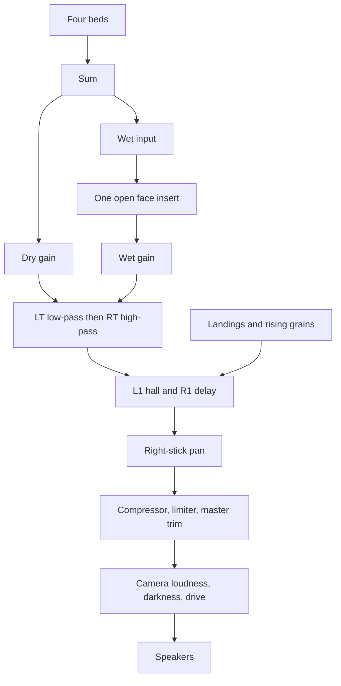

# The audio graph

Audible Field uses one Web Audio graph for every view. Diagnostics and Visualize move a point across four looping beds. Falling Blocks measures the playfield and writes the same beds, plus landings, rising grains, and a tail for each quadrant. The graph is built once in `audio-engine.js` and kept for the life of the page. Tabs change levels. They do not build a second mixer.

Commercial VSTs from the original Max patch cannot load in the browser. Face-button inserts are native Web Audio nodes, or a vendored [Web Audio Module](web-audio-modules.md) swapped into that same slot. How Falling Blocks turns the grid into these levels is in [Falling Blocks](falling-blocks.md).

## Where it lives

| Piece | Path |
| --- | --- |
| Graph, beds, voices, iOS unlock | [`web-visualizer/public/audio-engine.js`](../web-visualizer/public/audio-engine.js) |
| Shared position and controller | [`web-visualizer/public/mixer-core.js`](../web-visualizer/public/mixer-core.js) |
| Gesture listeners and start/stop queue | [`web-visualizer/public/app.js`](../web-visualizer/public/app.js) |
| WAM load and stick mapping | [`web-visualizer/public/wam-host.js`](../web-visualizer/public/wam-host.js) |
| Falling Blocks writes each frame | [`web-visualizer/public/falling-tab.js`](../web-visualizer/public/falling-tab.js) |

`export const audioEngine` is the single instance. `app.js` starts it, and every tab calls methods on that same object.

## What a listener hears

Four corners, four samples:

| Corner | Role |
| --- | --- |
| `tl` | Top-left bed |
| `tr` | Top-right bed |
| `bl` | Bottom-left bed |
| `br` | Bottom-right bed |

On Diagnostics and Visualize, pointer or stick position is an equal-power mix. `equalPowerMix` in `mixer-core.js` sharpens the bilinear weights (`MIX_GAMMA` 2.35) and takes a square root, so the middle of the pad stays even in loudness and the nearest corner still wins.

On Falling Blocks the mix position is ignored. Coverage, height, pitch, pan, and tails come from the grid. An empty field closes the master trim so a silent board stays silent.

Face buttons pick one wet insert. Cross closes every insert and leaves the dry path open. The left trigger is a low-pass, the right trigger is a high-pass, L1 is a parallel hall, and R1 is a decaying delay. The right stick pans the whole mix after those stages.

## Signal path



Beds are summed first. The dry path and the wet insert both enter the trigger filters. Shoulder effects sit after those filters. Landings and rising grains join at the shoulder output, past the face insert and the trigger filters. Pan, compression, the limiter, and the master trim come next. Camera distance is the last stage before the speakers.

### One bed

Each corner is its own chain into the sum:

```text
looping buffer  →  gain  →  mono  →  pan
                                  ├→ weight low-pass → low shelf → high shelf
                                  │       ├→ dry
                                  │       └→ soft clip
                                  │              → stem low-pass → sum
                                  ├→ hall send → shared hall → sum
                                  └→ Greyhole send → Greyhole → sum
```

The sample is a stereo file. A gain node folded to one channel sits in front of the panner so the pan control can place it. On Diagnostics and Visualize that pan stays centered. Falling Blocks pans from the pile.

After the panner, three things leave:

- **The dry bed.** A low-pass and a low shelf thicken a heavy pile. A level-matched tanh clip blends in as the same pile gets heavier. A second low-pass on the stem sets brightness from how wide the pour is. That chain is what reaches the shared sum.
- **A shared hall.** One convolver, with its own send from each bed, taken at the panner so the tail is not darkened by the weight filters. `setPileBody` holds those sends closed. Pile height is carried by the dry filters above.
- **A Greyhole.** One vendored Greyhole per bed, also taken at the panner. It loads with a fixed airy setting: size 3, diffusion near 1, and a delay kept inside the plugin's long buffer (`_greyholeDelayCeil`). Moving delay or size crossfades that buffer and glitches if the value keeps changing, so the live tail only moves the send, the return, and feedback. Falling Blocks opens the send for rising Diffuse grains. Feedback is the long tail.

The looping voice is an `AudioBufferSourceNode` once the file has decoded. The HTML media element is how the file starts and how a tap can begin playback before decode finishes. After the buffer is playing, the element is paused. An element loop leaves a gap at the wrap, and each element keeps its own decoder.

When Falling Blocks reports one note per connected pile, the single loop stops and each pile gets its own looping copy of that buffer, pitched and leveled on its own, still entering through the same stem gain.

### Shared mix

| Stage | What it does |
| --- | --- |
| Dry / wet gains | Cross sets dry to 1 and wet to 0. Any other face sets dry to 0.85 and wet to 0.45, and opens only that face's output gain. |
| Face insert | Square, Triangle, and Circle. Each slot is a native effect or a WAM wired between a private input gain and that slot's output gain. Inactive slots stay at gain 0. Cross cannot host a WAM. |
| LT low-pass | Open at 20 kHz. A pull sweeps it up from about 200 Hz. |
| RT high-pass | Open at 20 Hz. A pull sweeps it down from about 8 kHz. |
| L1 hall | Parallel send into a longer softened-noise convolver. The dry path is left alone. Attack about 0.12 s, release about 0.45 s. |
| R1 delay | 0.9 s delay with damped feedback. Attack about 0.03 s, release about 0.06 s. |
| Pan | Right stick, scaled to ±0.9. |
| Compressor | Threshold −12 dB, ratio 3.5. |
| Limiter | Threshold −2 dB, ratio 20. |
| Master trim | Open level 0.28. Four full-scale beds would otherwise sum well above full scale. Falling Blocks multiplies this by 0 when the field is empty and nothing is still ringing. |

Shoulder sends are scheduled only when the button changes. Writing a new ramp every frame would restart the release and make it feel instant.

Native inserts, used until a WAM is chosen and again if a WAM fails to load:

| Face | Native effect | Stick |
| --- | --- | --- |
| Cross | Waveshaper, kept closed while Cross is the mute face | — |
| Square | Short comb | X time, Y feedback |
| Triangle | Two peaking filters | X shift, Y resonance |
| Circle | Modulated delay with a high-pass in the loop | X time, Y feedback |

A loaded WAM replaces the native nodes in that slot. Stick axes drive the plugin's own parameters. Saved choices live in `localStorage` under `echoscape.fxPrefs` and are restored after the beds are already playing, so a slow plugin does not hold up the first sound.

### Landings and rising grains

These voices are buffer playback of the same quadrant sample. They connect to the shoulder output, after the face insert and the trigger filters, and they use the stem's pan.

- **Phrase** (the default splash) restarts the sample in phase with the bed, under the stem level, and opens a low-pass from the bed's current brightness. A short high octave glints with the ring.
- **Grain** and **tick** are short one-shots. Another hit on the same pile inside 110 ms is skipped.
- **Rising grains** are scraps of the bed (`drift`, `loose`, `flake`, `thread`, `shed`, `halo`). A quadrant with more rising atoms makes each one a little quieter.

Splash and rise behavior as the player hears it is tabulated in [Falling Blocks](falling-blocks.md#audio).

### Camera

After the master trim, distance from the default camera height does three things. At the default height the stage is unity gain, the low-pass is effectively open, and the clip is bypassed.

- Farther: quieter, and a low-pass darkens the mix.
- Closer: louder, and an equal-power blend into a tanh soft clip.

Falling Blocks sends this from the view. The other tabs leave it at the default.

## Who writes the controls

`sync(mixState, controller)` applies mixer-core state: equal-power stem gains, the active face, stick parameters, right-stick pan, both triggers, and L1 / R1. It is the path Diagnostics and Visualize use.

Falling Blocks calls `sync` with `stems: false`, then writes the grid itself:

| Call | What it sets |
| --- | --- |
| `setStemGains` | Level, pan, and brightness of each bed |
| `setStemPitch` | One rate, or one looping note per pile |
| `setPileBody` | Weight filters. Hall sends stay closed |
| `setDiffuseGreyhole` | Greyhole send, return, and feedback |
| `setStemReverb` | Height and decay on that same plugin. Each channel is created held, so this call leaves the plugin alone |
| `playSplash` | Landing voices |
| `syncRiseGrains` | Rising-atom voices |
| `setOutputLevel` | Master trim, including silence on an empty field |
| `setCameraPresence` | Loudness, darkness, and drive from zoom |

`stems: false` matters. `sync` would otherwise drop the center mix onto every bed for one render quantum. On an empty grid that quantum is a crackle.

Gains and filter frequencies go through `writeParam`. The same value is not written again. Assigning an `AudioParam` every frame inserts a new event, and on a quiet graph those events become crackles.

## Starting, pausing, and replacing a sample

`start` builds the graph, loads the four beds one after another, starts them, and only then restores WAM prefs. `resume` and `suspendPlayback` leave the nodes in place. Suspend pauses the bed elements and suspends the `AudioContext`. Falling Blocks uses that when its audio button is off. Leaving the tab while the context is suspended or interrupted asks the engine to play again.

`app.js` runs start, resume, and suspend on one promise chain so two of them cannot overlap.

`replaceStem` silences the old corner, then builds a new media element and the same per-stem chain. Sibling corners are left as they are, and `sync` runs again so their gains stay correct.

## Phones and iOS Safari

Desktop autoplay policy is "call `play()` and `resume()` during a click." iOS Safari adds several further rules, and a bed that was started the desktop way often never sounds. The engine treats a phone-class pointer as coarse (`pointer: coarse` and `maxTouchPoints > 0`). That covers iPhone and iPad touch. A few cases below are Safari-only even when that test is false.

### The tap has to do the work

Browsers ignore `AudioContext.resume()` and `HTMLMediaElement.play()` unless they run on a user gesture. `app.js` listens in the capture phase for a trusted `pointerdown`, `touchstart`, or `keydown`, and for `touchend` or `click` as the lift. Those call `beginGesture` immediately, before any `await`.

`beginGesture` does three things on that same stack:

1. Creates the `AudioContext` if the page does not have one yet (`AudioContext`, or `webkitAudioContext` on older Safari).
2. Calls `play()` on each bed element, including elements opened early so a tap can start them before the stem graph exists.
3. Resumes the context and starts the proof buffer described next.

Startup itself does not resume. A `resume()` before the finger arrives can spend the gesture and still leave the context suspended. `_safeResume` returns immediately until the speaker has been proved.

The lift is only a backup. If it arrives within 700 ms of the press, it finishes an unlock the press did not manage. It does not treat a held finger as a new attempt.

### Proof that the audio thread ran

On iOS a context can report `running` and still be silent. The engine plays a 250 ms buffer of very quiet noise straight to the speakers. Pure silence can be skipped, so the buffer is a tiny noise burst under a sine envelope. When that buffer ends, and the context is still the current one and still `running`, the speaker is proved.

Until that moment:

- The master trim is written with `.value`. `currentTime` stays at 0 while the context is suspended, and a scheduled event written then sticks after the clock starts.
- A looping bed started with `start()` is marked `bedAwaitingProof`. iOS discards a `start()` that happened while the context was suspended, so the bed would be "playing" and silent. After proof, those beds are stopped and started again from the same position.

When proof arrives, scheduled master events are cleared and the trim is set to the open level times the current amount.

### A proof that never finishes

If the finger is up, the context says it is running, and the proof buffer has not ended within 700 ms, that attempt counts as a miss and the context is suspended. The next press can try again inside a fresh gesture.

Two misses replace the `AudioContext` on the following press. Nodes belong to the context that created them, so the old context is closed, stem state is dropped, and `takeGraphRestart` tells `app.js` to build the graph again on the new context. That rebuild has to happen inside the same gesture.

### Lock, call, and a hidden tab

Safari sets the context to `interrupted` after the screen locks, a call arrives, or the tab is backgrounded. The engine treats `interrupted` the same as `suspended`.

Hiding the page, or `pagehide`, forgets the speaker proof. Showing the page again does not resume on its own. The next real press does. If the context never left `running`, only bed elements that actually paused are started again.

### The silent switch

An HTML media element follows the iPhone ringer switch. A Web Audio buffer does not. On a phone-class screen the media element stays at volume 0 and its `MediaElementSource` is left out of the graph. `play()` still runs during the gesture, because that is what Safari requires before later buffer playback is allowed. The sound the phone plays is the looping buffer, the pile notes, and the splash and rise voices.

On a desktop pointer the element is connected and turned up until the buffer takes over, so there is sound before decode finishes.

### What to expect on a phone

- The first sound waits for a tap, a touch, or a key. Loading the page is not that gesture.
- After the screen locks or the tab sleeps, the next touch starts the beds again.
- The ringer switch does not mute the beds once they are buffer voices.
- Falling Blocks with audio turned off ignores these gestures and leaves the context suspended.
- The header health line is the quick check: sample rate, context state (`running`, `suspended`, or `interrupted`), how many beds are playing, live strike voices, and how many WAMs are in the graph.
