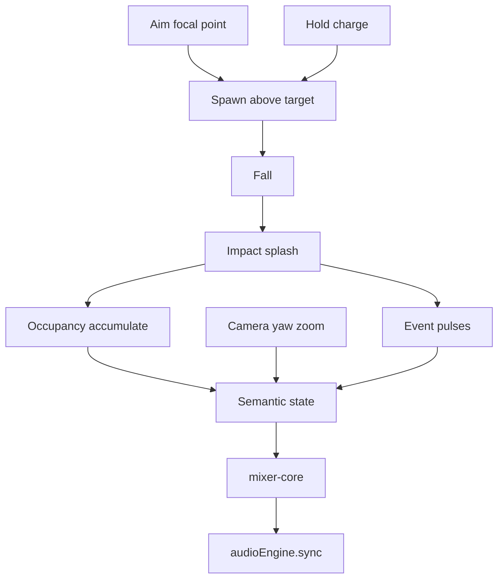

# Falling Blocks

## Why this approach

ECHOSCAPE today maps **controller state → audio**. This prototype maps **built world state + action events → audio**, using the same mixer and graph.

Falling Blocks is the gesture variant: the player aims a focal point, then **throws mass into the landscape**. Each action has a clear timeline—flight, impact, assimilation—closer to holding a controller button than to painting cells. Accumulation still builds persistent form; the drop is the performative event.

Companion design (separate track): [Placing Blocks](placing-blocks.md).

## Approach

A ground plane (liquid surface) holds accumulated material. The player aims a **target** on that plane, then drops.

| Input | Action |
| --- | --- |
| Move focal point | Aim where the next block will land (pointer and/or camera-relative target) |
| Press drop | Spawn a block above the target; it falls |
| Hold drop | Charge: longer hold → more mass (taller stack or heavier block) before release |
| Palette | Select material color / type |
| Orbit / zoom | Listen from different angles and distances |

On impact: splash, occupy cells, structure updates. Colors define material families the same way as in Placing Blocks; the **input vocabulary** differs.

v1 uses a simple kinematic fall (spawn → move down → land). No full physics engine required for the first experiment.



## Audio thesis

Do not rebuild Web Audio / WAM. Drive the existing path:

| Piece | Path |
| --- | --- |
| Shared mixer state | [`web-visualizer/public/mixer-core.js`](../web-visualizer/public/mixer-core.js) |
| Graph + `sync()` | [`web-visualizer/public/audio-engine.js`](../web-visualizer/public/audio-engine.js) |
| Stick→WAM maps (pattern) | [`web-visualizer/public/wam-stick-maps.js`](../web-visualizer/public/wam-stick-maps.js) |
| Visualize host / Three.js | [`web-visualizer/public/visualize.js`](../web-visualizer/public/visualize.js) |

Three timescales:

| Layer | Question | Falling Blocks examples | Audio role |
| --- | --- | --- | --- |
| Material | What process? | Block color | Effect family (face FX slots) |
| Form | What parameters? | Accumulated mass, height, footprint, screen position | Wet depth, stick-like XY, pan |
| Event | What just happened? | Charge peak, flight start, impact, assimilate | Gestural impulses |

### Camera as listening position

| View | Mixer control | Mapping |
| --- | --- | --- |
| Yaw around build | `setTarget` → pad `x/y` | Continuous four-stem blend (cardinals = corners) |
| Zoom | LT tone + RT hall | Acoustic distance: out = darker + wetter; in = brighter + drier |
| Structure vs camera | `rightX` pan | World position → camera space → stereo |

### Architecture → effects (v1)

| World | Audio |
| --- | --- |
| Camera yaw | Four-source equal-power mix |
| Zoom | Tone + hall (distance), not a pure volume knob |
| Per-color accumulated mass | FX wet/depth for that family |
| Structure screen-X | Stereo pan |
| Charge / release | Gesture energy into event bus |
| Impact | Transient + splash; then mass joins persistent `world` |
| Assimilation (optional later) | Soft settle of params after impact |

### Semantic state contract

World code describes itself; a thin adapter writes mixer-core. Objects do not poke AudioNodes directly.

```js
{
  view: { angle: 0.32, zoom: 0.68 },
  world: {
    redMass: 0.42,
    blueMass: 0.77,
    greenMass: 0.18,
    yellowMass: 0.05,
    height: 0.63,
    density: 0.51,
    fragmentation: 0.24,
    connectivity: 0.81
  },
  events: {
    charge: 0,
    release: 0,
    impact: 0,
    assimilate: 0
  }
}
```

Event fields are impulses (set high, decay to 0). Persistent sound comes from `view` + `world` after material has landed.

### Why this mapping fits Falling Blocks

Three readable phases map cleanly to sound:

1. **In flight** — anticipation (optional quiet or rising charge tail)
2. **Impact** — splash / transient
3. **Assimilated** — structure stats update; FX settle to new steady state

That separation is the main advantage over click-place for proving “gameplay events perform the soundscape.”

## First steps

Order matters. Stop after each step if the gesture or mapping is unclear.

### 1. Scene and aim

- Host beside or inside the Visualize tab canvas lifecycle in [`visualize.js`](../web-visualizer/public/visualize.js)
- Flat plane; orbit + zoom
- Visible focal-point marker on the ground (raycast from pointer or fixed aim under camera)
- No audio yet

### 2. Fall and land

- On press (or release of a short tap): spawn a colored cube above the target
- Animate downward until it hits the plane or top of an existing stack
- Write into an occupancy grid / stack height at that column
- Visual splash on contact

### 3. Hold to charge

- While button held: grow charge (UI meter and/or preview mass above target)
- On release: drop mass proportional to hold time (N stacked cells, or one heavier contribution)
- Map peak charge → `events.charge` / `events.release`

### 4. Semantic → mixer adapter

- Same adapter pattern as Placing Blocks: semantic object → mixer-core setters
- Yaw → `setTarget`; zoom → tone/hall; masses → FX depth; centroid → pan
- Prefer updating `world.*` **on impact**, not continuously during flight (keeps phases distinct)
- Keep [`audioEngine.sync`](../web-visualizer/public/audio-engine.js) as the only audio consumer

### 5. Impact and event polish

- Stronger impact pulse than place-click would need
- Optional short assimilate ramp after land (params ease to new mass)
- Connected-component merge when stacks touch (same logic as Placing; secondary here)

## Success criteria

Aiming and dropping feels like **performing** into a place: impact is audible and visible; holding longer changes the result; orbiting still blends the four stems; the pile you leave behind keeps shaping the mix after the gesture ends.

## Later (not first steps)

- Soft assimilation (rigid faller melts into density field / metaballs)
- Material verbs (erode, burn, bind, resonate)
- True structural collapse under removed support
- Multi-block volleys / AI or second player as drop sources
- WebGPU

## Out of scope

- Click-to-place / right-click carve as primary edit ([placing-blocks.md](placing-blocks.md))
- Rebuilding Max or the browser WAM graph
- Unreal / Steam client
- Multiplayer
- Full rigid-body physics for hundreds of pieces
