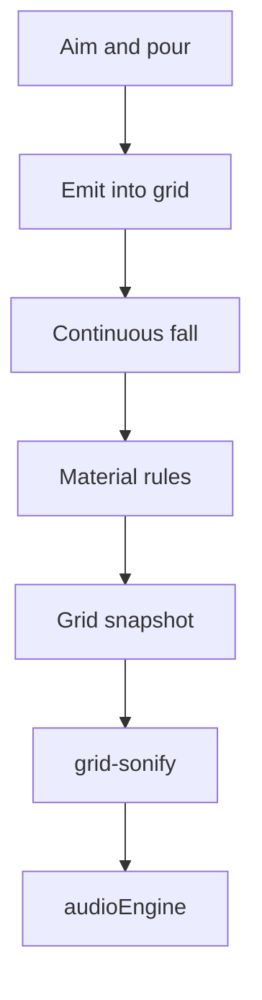

# Falling Blocks

The Falling Blocks tab pours atoms onto a ground plane. Where they land, how wide the pile is, and how tall it stands drive the four stem samples. The Web Audio / WAM graph is the same one the rest of ECHOSCAPE uses.

Companion design (separate track): [Placing Blocks](placing-blocks.md).

## Where it lives

Own tab, not a mode inside Visualize.

| Piece | Path |
| --- | --- |
| Tab + audio tick | [`web-visualizer/public/falling-tab.js`](../web-visualizer/public/falling-tab.js) |
| Scene, sim, snapshot | [`web-visualizer/public/falling-blocks.js`](../web-visualizer/public/falling-blocks.js) |
| Pointer, keys, pad | [`web-visualizer/public/falling-input.js`](../web-visualizer/public/falling-input.js) |
| Binding table | [`web-visualizer/public/input-bindings.js`](../web-visualizer/public/input-bindings.js) |
| Materials and rules | [`web-visualizer/public/materials.json`](../web-visualizer/public/materials.json) |
| Rule step | [`web-visualizer/public/rule-engine.js`](../web-visualizer/public/rule-engine.js) |
| Quadrant → stem levels | [`web-visualizer/public/grid-sonify.js`](../web-visualizer/public/grid-sonify.js) |
| Graph | [`web-visualizer/public/audio-engine.js`](../web-visualizer/public/audio-engine.js) |

## Play

An emitter sits above the plane and follows the pointer, left stick, or D-pad. Holding an emit control pours the selected material. The pour continues until the control is released. There is no charge-and-release drop.

| Input | Action |
| --- | --- |
| Move pointer, left stick, or D-pad | Aim the emitter. At the edge of the view the plane scrolls so the rest of the field stays reachable. |
| Left click, X, Cross, or touchpad click | Pour the widest brush (11×11) at full atom size. |
| Shift + left click, or left trigger | Pour a single half-size stream. |
| Right trigger | Pressure. A light pull is the single half-size stream. A deep pull opens the wide full-size field. |
| Right-drag | Slide the playfield. |
| Middle-drag, Shift+right-drag, Alt+right-drag, or right stick X | Yaw the playfield under the emitter. |
| One finger | Pan the field under the emitter. The emitter stays at screen center. |
| Two-finger twist | Yaw the field around the emitter. |
| Pinch | Zoom toward and away from the emitter. |
| Wheel or right stick Y | Zoom. |
| L1 / R1, or Tab / Shift+Tab | Previous / next material. |
| Circle, or the clear button | Clear the board. |
| Square, or the audio button | Toggle field sonification. |

DualSense touchpad: a finger aims; a click pours the wide brush. The touchpad is not routed to the mixer while this tab is up.

Each cell of a multi-cell brush rolls a chance (`EMIT_CHANCE` 0.4), so a clump cascades instead of falling as one slab. A 1×1 pour always places. The footprint waits about 0.16s after a size change before atoms start coming out.

## Field

Fixed atom pitch 0.25 on a 16-unit plane. The camera sits at a fixed 60° pitch. Distance zooms (default 30, range 10–60). Yaw and slide move the surface, not the camera orbit.

The plane is split into four quadrants. Those quadrants are the four stems:

| Quadrant | Stem color |
| --- | --- |
| Top-left | Red |
| Top-right | Yellow |
| Bottom-left | Blue |
| Bottom-right | Green |

Sky color blends those same quadrants from surface yaw. That blend is visual. Stem loudness comes from which quadrant holds atoms, not from the camera angle.

## Materials

Palette entries come from [`materials.json`](../web-visualizer/public/materials.json). Default is Block. The floor material is liquid. Active types:

| Material | Behavior |
| --- | --- |
| Block | Falls. A lone block on the floor shrinks and clears. A block with the same material above it ages out, so a pile of blocks loses height. |
| Sand | Falls and slides into gaps. |
| Diffuse | Falls and slides. Resting grains with nothing above rise and clear. Contact converts other atoms into Diffuse, so piles dissipate. |
| Erode | Falls, slides, and creeps. Clears what it touches and leaves a shrink. `sonify: false`, so Erode grains stay out of the audio measures. |

Commented-out types in the same file (Slime, Block Exp, Etch, Water) are not in the palette.

## Simulation

Atoms fall continuously (about 28 world units per second) until they meet the floor or another atom. A rule step at 22 Hz then applies each material's diagrams: fall, slide, creep, age, convert, vacuum, clear.

Sonifying atoms sample a lifetime when they are poured. A wave between 0.1s and 5s keeps moving whether or not anything is emitting (period 0.4s). The HUD shows that wave and the last few emitted lifetimes.

## Audio

`captureAudioSnapshot` describes the grid. `fieldFrame` in `grid-sonify.js` turns one frame of that snapshot into stem controls. `falling-tab.js` writes them on the audio engine. Face effect slots stay dry: the controller shadow passed into `sync` is zeros.

Per quadrant, for atoms that sonify:

| World | Audio |
| --- | --- |
| Ground cells occupied | Stem gain. Wider coverage is louder. The same amount opens that stem's low-pass, from about 7 kHz on a single column toward 20 kHz on a wide pour. |
| Tallest resting column | Weight on that pile's stem. Taller darkens a low-pass from 18 kHz toward 2.5 kHz, adds a low shelf up to +6 dB, and blends in a level-matched soft clip. Full weight is 10 atoms. Rising grains do not add to it. |
| Diffuse grains rising | Greyhole send, taken before the weight filters so the tail stays bright. Feedback jumps to the long tail as soon as they lift, then releases slowly while the quadrant still has material. An empty quadrant fades that tail quickly. Pitch stays where the pile sits. |
| Distance to the quadrant center | Playback rate. The center is an octave up. The quadrant corners stay at the sample's own pitch. Settled height and rising Diffuse grains do not change pitch. |
| Pile position after yaw, plus where the plane sits in the view | Stereo pan of that stem. |
| Landing | A splash ring, and one event at the pitch of the pile. Grain plays about 70 ms of that quadrant's sample, from a slice chosen by the landing cell, with a light high-pass. Tick is a short noise burst through a bandpass at 240 Hz times the pile pitch. Phrase restarts the sample in phase with the bed, and its low-pass opens from the bed's cutoff toward 20 kHz across the ring. Grain and tick skip another landing on the same pile for 110 ms, so a pour is a patter. The settings panel switches the three. A heavier landing is a little louder. |
| Zoom closer than default | Louder, with a soft clip. |
| Zoom farther than default | Quieter, low-passed. |

Erode does not add coverage, height, pan, or splash. Clearing the board or turning audio off resets the sonify followers.

## Still out of scope

- Click-to-place as the primary edit ([placing-blocks.md](placing-blocks.md))
- Rebuilding the browser WAM graph
- Unreal / Steam client
- Multiplayer
- A rigid-body solver for loose pieces
- Melting landed mass into a density field
- Structural collapse when support is removed, beyond what a material rule already clears
