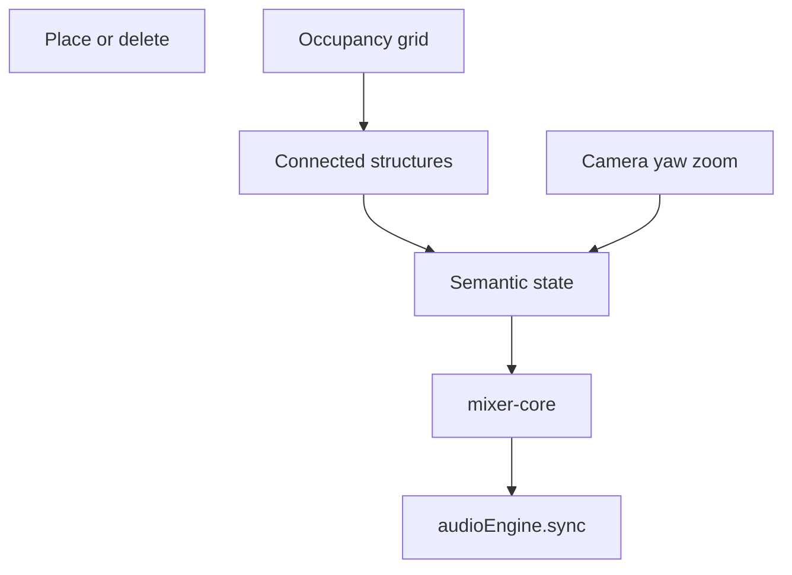

# Placing Blocks

## Why this approach

ECHOSCAPE today maps **controller state → audio**. This prototype maps **built world state + edit events → audio**, using the same mixer and graph.

Placing Blocks is the direct-construction variant: the player points at the world and edits it cell by cell. The distinctive musical gesture is **bridging separate structures** so they merge—rewiring the soundscape by joining architecture.

Companion design (separate track): [Falling Blocks](falling-blocks.md).

## Approach

A small build area sits on a liquid surface. The player orbits and zooms. A color palette selects material type.

| Input | Action |
| --- | --- |
| Left click | Place a block of the current color at the raycast cell |
| Right click | Remove / carve at the raycast cell |
| Palette | Select material (red / blue / green / yellow) |
| Orbit | Rotate camera around the build center |
| Zoom | Move camera closer or farther |

Blocks stack. When occupied cells of separate piles **touch**, they become one logical structure (connected components). Place and delete splash the liquid.

v1 does **not** procedurally invent houses or arches. A click places a cube; the algorithm that matters for audio is occupancy, stacking, and merge—not fancy architecture yet.



## Audio thesis

Do not rebuild Web Audio / WAM. Drive the existing path:

| Piece | Path |
| --- | --- |
| Shared mixer state | [`web-visualizer/public/mixer-core.js`](../web-visualizer/public/mixer-core.js) |
| Graph + `sync()` | [`web-visualizer/public/audio-engine.js`](../web-visualizer/public/audio-engine.js) |
| Stick→WAM maps (pattern) | [`web-visualizer/public/wam-stick-maps.js`](../web-visualizer/public/wam-stick-maps.js) |
| Visualize host / Three.js | [`web-visualizer/public/visualize.js`](../web-visualizer/public/visualize.js) |

Three timescales:

| Layer | Question | Placing Blocks examples | Audio role |
| --- | --- | --- | --- |
| Material | What process? | Block color | Effect family (face FX slots) |
| Form | What parameters? | Mass, height, footprint, connectivity, screen position | Wet depth, stick-like XY, pan |
| Event | What just happened? | Place, delete, merge, collapse | Short pulses / transitions |

### Camera as listening position

| View | Mixer control | Mapping |
| --- | --- | --- |
| Yaw around build | `setTarget` → pad `x/y` | Continuous four-stem blend (cardinals = corners) |
| Zoom | LT tone + RT hall | Acoustic distance: out = darker + wetter; in = brighter + drier |
| Structure vs camera | `rightX` pan | World position → camera space → stereo |

### Architecture → effects (v1)

| World | Audio |
| --- | --- |
| Camera yaw | Four-source equal-power mix |
| Zoom | Tone + hall (distance), not a pure volume knob |
| Red / blue / green / yellow mass | FX wet/depth for that family |
| Structure screen-X | Stereo pan |
| Cells touch → merge | Merge pulse + combined structure stats |
| Delete | Mass/param decrease |
| Unsupported stack dissolves | Collapse pulse + rapid decay |

### Semantic state contract

World code describes itself; a thin adapter writes mixer-core. Objects do not poke AudioNodes directly.

```js
{
  view: { angle: 0.32, zoom: 0.68 },
  world: {
    redMass: 0.42,
    blueMass: 0.77,
    greenMass: 0.18,
    yellowMass: 0.05,
    height: 0.63,
    density: 0.51,
    fragmentation: 0.24,
    connectivity: 0.81
  },
  events: {
    place: 0,
    delete: 0,
    merge: 0,
    collapse: 0
  }
}
```

Event fields are impulses (set high, decay to 0). Persistent sound comes from `view` + `world`.

## First steps

Order matters. Stop after each step if the interaction or mapping is unclear.

### 1. Scene and camera

- Host beside or inside the Visualize tab canvas lifecycle in [`visualize.js`](../web-visualizer/public/visualize.js)
- Flat plane (liquid look can be a simple material + splash later)
- Orbit around build center; zoom in/out
- No audio yet

### 2. Grid place and delete

- Occupancy grid on the plane (e.g. modest footprint, limited height)
- Left click raycast → occupy cell with current palette color (instanced or simple cubes)
- Right click → clear cell
- Palette UI: four colors

### 3. Connected merge

- After each edit, run connected-component labeling (6-neighbor)
- Emit structure records: block count, color fractions, centroid, height
- When two components become one: fire a **merge** event
- When one splits or a tower loses support: fire **collapse** / treat as split (v1 can dissolve unsupported cells without rigid-body physics)

### 4. Semantic → mixer adapter

- Each frame (or on change): build the semantic object above
- Yaw → `setTarget` (same space as touchpad)
- Zoom → triggers (tone / hall) for distance
- Per-color mass → active FX wet/depth and/or `setFxStick`-style params
- Dominant or nearest structure centroid → pan
- Keep [`audioEngine.sync`](../web-visualizer/public/audio-engine.js) as the only audio consumer

### 5. Splash and event polish

- Visual splash/ripple on place and delete
- Brief audio event response from `events.*` (do not turn every click into a full percussion sequencer)

## Success criteria

You can **hear** what you **see**: orbiting blends stems; a tall red pile deepens its effect; bridging two piles produces a noticeable merge moment; carving mass back reduces processing.

## Later (not first steps)

- Soft forms (density field, Marching Cubes, time-based assimilation)
- Material verbs (echo duplicate, erode, burn, bind)
- Serial FX routing on merge (true graph rewiring beyond coupled params)
- Procedural architecture beyond cubes
- WebGPU

## Out of scope

- Falling Blocks physics, hold-to-charge drop, mid-air objects ([falling-blocks.md](falling-blocks.md))
- Rebuilding Max or the browser WAM graph
- Unreal / Steam client
- Multiplayer
