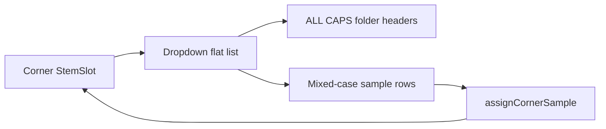

# Quadrant sample dropdown

## Understanding (confirmed)

- Each pad quadrant label is the control (already `data-stem-slot` buttons).
- Click opens a **dropdown** (not the folder-browser modal) anchored to that label.
- List is **flat**: one scrollable menu of all library files, grouped by folder.
- **Category headers** use the FX all-caps style (`.fx-btn`: muted, uppercase, letter-spacing).
- **Sample rows** use the FX title mixed-case style (`.fx-card h3`: brighter, weight 600, no forced uppercase).
- On select, that sample loads into the corner and the **label text becomes the sample’s display name** (mixed case).

**Category grouping default:** group by relative folder path under `samples/` (e.g. `loops/percussive`, `pads/ambient`, `one-shots`), rendered as `LOOPS / PERCUSSIVE`. Empty folders omitted.



## Implementation

### 1. API: list all samples (flat + grouped)

In [`web-visualizer/server.js`](web-visualizer/server.js), add `GET /api/samples/all` that walks `SAMPLES_DIR` recursively and returns:

```json
{
  "groups": [
    { "folder": "loops/percussive", "files": ["Beat 6.wav", "..."] },
    { "folder": "pads/ambient", "files": ["Atmos Hi Ho.wav", "..."] }
  ]
}
```

Same audio-ext filter and path-traversal guards as today’s listing. Skip `.asd` and empty groups.

### 2. Dropdown UI (replace corner modal path)

In [`web-visualizer/public/sample-picker.js`](web-visualizer/public/sample-picker.js) (or a small sibling module), add `openStemDropdown({ anchor, corner, onSelect })`:

- Position a popover under/near the clicked StemSlot (`anchor.getBoundingClientRect()`).
- Fetch `/api/samples/all` once (cache in memory).
- Render: non-clickable header rows + button rows for each file.
- Click outside / Escape closes; `stopPropagation` so pad drag does not steal the click.
- Keep the existing modal `openSamplePicker` for the header **Samples** button (browse + assign-corner dialog).

Wire [`app.js`](web-visualizer/public/app.js) `openCornerPicker` to call `openStemDropdown` instead of `openSamplePicker`, still using `assignCornerSample`.

### 3. Label typography

In [`styles.css`](web-visualizer/public/styles.css):

- **Remove** `text-transform: uppercase` from `.quad .name` / StemSlot so the selected sample shows mixed case (e.g. `Atmos Hi Ho`).
- Style dropdown headers with `.fx-btn`-equivalent rules; sample rows with `.fx-card h3`-equivalent rules.
- Dropdown panel: dark surface, border, max-height + scroll, high z-index above the pad.

Display name = filename without extension (current `file.label` behavior).

### 4. Cache bust

Bump `app.js` / CSS query versions in [`index.html`](web-visualizer/public/index.html).

## Out of scope

- Changing header Samples modal browse UX.
- Renaming files on disk.
- Auto-converting `.aif` (still listed; browser may not play them).
