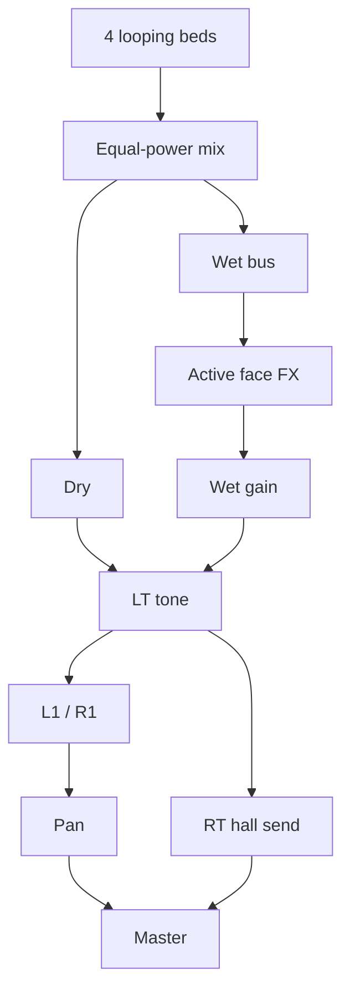

# Web Audio Modules — planning & catalog

## Why WAMs here

Native **VST / VST3** plugins cannot load in the browser Web Audio graph. EchoScape’s Max patch hosts real VSTs; the browser visualizer approximates the same routing with Web Audio nodes (and optionally **WAM2** plugins).

WAMs are the web-native plugin format: loadable ES modules that expose an `audioNode` for the AudioContext graph, plus optional GUI / MIDI / automation.

**EchoScape policy:** everything ships **local** under `web-visualizer/public/wams/`. No runtime CDN fetches.

## Architecture (browser)



Face buttons select one wet insert: **Cross / Square / Triangle / Circle**. Stick XY maps into that insert’s parameters.

Relevant code:

| Piece | Path |
| --- | --- |
| WAM host | [`web-visualizer/public/wam-host.js`](../web-visualizer/public/wam-host.js) |
| Audio graph | [`web-visualizer/public/audio-engine.js`](../web-visualizer/public/audio-engine.js) |
| Vendored plugins | [`web-visualizer/public/wams/`](../web-visualizer/public/wams/) |
| MIME (`.wasm`) | [`web-visualizer/server.js`](../web-visualizer/server.js) |

## Local vendor layout

```
web-visualizer/public/wams/
  wimmics/
    OwlShimmer/          # plugin + OwlShimmer.wasm + Gui
    utils/               # shared SDK (required by wimmics WAMs)
      sdk/
      sdk-parammgr/
      webaudio-controls.js
```

Load path pattern (served as static files):

- Host SDK: `/wams/wimmics/utils/sdk/src/initializeWamHost.js`
- Plugin: `/wams/wimmics/OwlShimmer/index.js`

Burns Audio (Sequencer Party) plugins live under `burns-audio/` in the community pack and use their own relative layout if vendored later—do not assume they share `wimmics/utils`.

### How to vendor another Wimmics plugin

1. Obtain the community package (npm `wam-community` or GitHub [`boourns/wam-community`](https://github.com/boourns/wam-community) `dist/plugins/`).
2. Copy `dist/plugins/wimmics/<PluginName>/` → `public/wams/wimmics/<PluginName>/`.
3. Keep a single shared `public/wams/wimmics/utils/` (already present).
4. Point `loadWam(ctx, "wimmics/<PluginName>/index.js")` from `wam-host.js` / `audio-engine.js`.
5. Map DualSense stick XY → plugin param addresses (see Faust `/untitled/...` or `/PluginName/...` aliases).
6. Update this catalog’s **EchoScape slot map** and mark status.

## Current EchoScape slot map

| Slot | Max (typical) | Browser today | WAM status | Stick idea |
| --- | --- | --- | --- | --- |
| **Cross** | Saturn 2 | Native waveshaper | **Vendored:** Temper, Simple Distortion, QuadraFuzz | X = drive, Y = tone |
| **Square** | kHs Comb | Native delay comb | **Vendored:** ThruZeroFlanger, StonePhaser, WeirdPhaser, PingPongDelay | X = time/rate, Y = feedback |
| **Triangle** | kHs Formant | Native dual peaking | **Vendored:** SweetWah, DualPitchShifter, GraphicEqualizer | X = formant shift, Y = resonance |
| **Circle** | Crystallizer | OWLShimmer default | **Vendored:** OWLShimmer, DualPitchShifter, OwlDirty, Grey Hole | X = shimmer/tone, Y = decay/mix |
| **RT hall** | Ambient reverb | Native noise IR | **Vendored (not wired yet):** Grey Hole, Microverb (`burns-audio/reverb`) | RT depth only |
| **L1 / R1** | Shoulder color | Native abyss / glass bloom | Optional later | Momentary |

## Catalog — community WAM2 plugins

Source index (reference only; do not load at runtime):  
https://www.webaudiomodules.com/community/plugins.json  
Browse / audition: https://wamlist.com/

**Relevance key**

- **A** — Strong insert-FX fit for EchoScape wet slots or RT hall  
- **B** — Useful but secondary (amp/pedalboard/viz)  
- **C** — Instruments / MIDI / video / utilities — not for current wet bus  

**Status key**

- `vendored` — present under `public/wams/`  
- `wired` — connected in `audio-engine.js`  
- `candidate` — shortlisted  
- `skip` — not planned for insert FX  

### Effect / Distortion — A

| Name | Vendor | Path | Status | Notes |
| --- | --- | --- | --- | --- |
| Simple Distortion | Sequencer Party | `burns-audio/distortion/` | **vendored** | Cross-like waveshaper |
| Temper | Wimmics | `wimmics/temper/` | **vendored** | Phase-y digital drive |
| QuadraFuzz | Wimmics | `wimmics/quadrafuzz/dist/` | **vendored** | Multiband fuzz |
| TS9 Overdrive | Wimmics | `wimmics/TS9_Overdrive/` | candidate | Pedal color |
| Big Muff | Wimmics | `wimmics/BigMuff/` | candidate | Heavy fuzz |
| KppFuzz | Wimmics | `wimmics/Kpp_fuzz/` | candidate | Vintage fuzz |
| KppDistorder | Wimmics | `wimmics/kppdistorder/` | candidate | Distortion + EQ |
| OSCTube | Wimmics | `wimmics/OscTube/` | candidate | Tube + vibrato |
| Overdriverix | Wimmics | `wimmics/OverdriveRix/` | candidate | Faust overdrive |

### Effect / Amp — B

| Name | Vendor | Path | Status | Notes |
| --- | --- | --- | --- | --- |
| DistoMachine | Wimmics | `wimmics/disto_machine/` | candidate | Marshall-ish amp sim |
| Vox Amp 30 | Wimmics | `wimmics/GuitarAmpSim60s/` | skip | Guitar-centric |

### Effect / Delay — A

| Name | Vendor | Path | Status | Notes |
| --- | --- | --- | --- | --- |
| Simple Delay | Sequencer Party | `burns-audio/delay/` | candidate | Stereo filtered delay |
| PingPongDelay | Wimmics | `wimmics/pingpongdelay/dist/` | **vendored** | Classic ping-pong |
| SmoothDelay | Wimmics | `wimmics/SmoothDelay/` | candidate | Click-free time changes |

### Effect / Reverb — A

| Name | Vendor | Path | Status | Notes |
| --- | --- | --- | --- | --- |
| **OWLShimmer** | Wimmics | `wimmics/OwlShimmer/` | **vendored + wired** | Shimmer reverb; Crystallizer-adjacent |
| Grey Hole | Wimmics | `wimmics/greyhole/` | **vendored** | Blackhole-ish; Circle / RT hall |
| OwlDirty | Wimmics | `wimmics/OwlDirty/` | **vendored** | Dirty reverb tail; Circle |

### Effect / EQ & filter — A/B

| Name | Vendor | Path | Status | Notes |
| --- | --- | --- | --- | --- |
| Simple EQ | Sequencer Party | `burns-audio/simpleEQ/` | candidate | Three-band |
| GraphicEqualizer | Wimmics | `wimmics/graphicEqualizer/` | **vendored** | Bank of filters |
| SweetWah | Wimmics | `wimmics/sweetWah/` | **vendored** | Autowah; Triangle-adjacent |
| Blipper | Wimmics | `wimmics/blipper/` | skip | Percussion synth-ish |

### Effect / Modulation — A

| Name | Vendor | Path | Status | Notes |
| --- | --- | --- | --- | --- |
| StonePhaser | Wimmics | `wimmics/stonephaser/` | **vendored** | Small Stone–like |
| ThruZeroFlanger | Wimmics | `wimmics/ThruZeroFlanger/` | **vendored** | Comb-adjacent |
| WeirdPhaser | Wimmics | `wimmics/WeirdPhaser/` | **vendored** | Stereo SSB phaser |
| Stereo Enhancer | Wimmics | `wimmics/StereoEnhancer/` | candidate | Width (post-pan optional) |

### Effect / Pitch — A/B

| Name | Vendor | Path | Status | Notes |
| --- | --- | --- | --- | --- |
| DualPitchShifter | Wimmics | `wimmics/DualPitchShifter/` | **vendored** | Crystallizer-family |
| StereoFreqShifter | Wimmics | `wimmics/StereoFreqShifter/` | candidate | Lush stereo shift |
| Csound Pitch Shifter | Wimmics | `wimmics/csoundPitchShifter/` | candidate | WASM size / CPU watch |

### Pedalboard / utility / viz — B

| Name | Path | Status | Notes |
| --- | --- | --- | --- |
| React Pedalboard | `wimmics/pedalboard/` | skip | Nested host; complexity |
| Pedalboard WAC2022 | `wimmics/PedalBoard-WAC2022/` | skip | Same |
| DeathGate | `wimmics/deathgate/` | skip | Gate, not character FX |
| LiveGain / Oscilloscope / Spectrogram / Spectroscope | `wimmics/SRVisualizers/` | skip | Diagnostics only |
| Audio Input | `burns-audio/audio_input/` | skip | Mic/line in |

### Instruments / MIDI / video — C

Soundfont Player, DRM-16, Spectrum Modal, Synth-101, Audio Track, sequencers, MIDI I/O, hardware editors, Envelope Follower, Randomizer, Step Sequencer, ButterChurn, ISF, ThreeJS, Video Input — **out of scope** for the wet-bus PoC unless the product adds instrument tracks.

## Stick → WAM parameter maps

Hand-editable lookup: `web-visualizer/public/wam-stick-maps.js`.

Each vendored WAM has an entry with:

- `params` — id, label, min, max, default
- `x` / `y` — param ids driven by stick axes (normalized 0–1 → min–max × scale stepper)
- `forceOff` — params forced to 0 while active (bypass)

Change bindings by editing the `x` / `y` arrays. Probe live metadata with `node scripts/probe-wam-params.mjs` (writes `scripts/wam-params-probe.json`).

## OWLShimmer (Circle) — default map

| Param | Address | Range | Default stick |
| --- | --- | --- | --- |
| SHIMMER | `/untitled/SHIMMER` | 0–0.7 | X |
| TONE | `/untitled/TONE` | 900–8000 | X |
| DECAY | `/untitled/DECAY` | 0.5–1 | Y |
| MIX | `/untitled/MIX` | 0–1 | Y |
| bypass | `/untitled/bypass` | 0/1 | Forced 0 |

Native crystallizer remains the fallback if WAM load fails (`circleFxMode`: `wam` | `native`).

## Planning decisions

1. **One WAM per face slot first** — avoid pedalboard hosts until single inserts feel right.
2. **Always local** — copy into `public/wams/`; never depend on webaudiomodules.com at runtime.
3. **Native fallback** — keep a Web Audio approximation so browser mode still works if a plugin fails.
4. **CPU budget** — Faust/WASM reverbs are heavier than Biquad/Delay; prefer one heavy wet insert at a time (matches Max face-button exclusivity).
5. **GUI optional** — EchoScape drives params from DualSense; plugin GUIs are for audition/debug only.

## Suggested next picks

| Priority | Plugin | Target slot | Why |
| --- | --- | --- | --- |
| 1 | Grey Hole or KBVerb | RT hall | Replace synthetic IR; ambient beds |
| 2 | Temper or Simple Distortion | Cross | Closer to Saturn saturation |
| 3 | ThruZeroFlanger or StonePhaser | Square | Comb / modulation character |
| 4 | SweetWah or DualPitchShifter | Triangle | Formant / weird pitch |

When adopting one: vendor → wire → update this table’s Status column → note stick mapping in a short subsection like OWLShimmer above.

## Open questions

- Prefer **Grey Hole** vs **KBVerb** for RT (darker vs cleaner)?
- Should Circle stay OWLShimmer long-term, or try DualPitchShifter for a truer Crystallizer?
- Vendor **entire** `wimmics/` set (~many MB) vs copy plugins on demand? Current choice: **on demand** + shared `utils/`.
